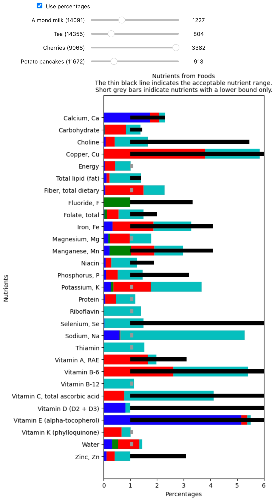

# Nutritionally Complete Foods v0.1

## Overview

This program finds what combination of foods are nutritoinally complete. This problem is related to the Stigler Diet problem, but instead of trying to minimize cost, we're trying to find the solutions that use the fewest distinct food types. We sets a system of inequalities to model a person's dietary needs, then find a combination of foods that will satisfy the inequalities.

## Environment Setup

Project requirements are stored in `requirements.txt`. Setting up an envronment is a little outside of the scope of this readme, but if you are unfamiliar with how to do so, I've included my preferred method in the expandable section below.

<details>
  <summary>Environment setup</summary>

```
# Install pyenv
curl https://pyenv.run | bash

# Create a virtual environment with the latest Python 3
pyenv virtualenv 3 nutritionally-complete-foods

# Activate that virtual environment
pyenv activate nutritionally-complete-foods

# Install the requirements to that environment
pip install -r requirements.txt

# ...

# Deactivate the environment when you're done
source deactive
```

</details>


## Source Data

Before running the solver, download and parse the food data by running this script:

```
cd data
python create_food_data.py
```

This will result in a file called `food_data.csv` which is one of two input files for the solver.

The other input file is the daily recommended values, which comes from the [USDA's Dietary Reference Intake (DRI) Calculator](https://www.nal.usda.gov/human-nutrition-and-food-safety/dri-calculator). You can either use the example values packaged in this repo `data/Daily Recommended Values.csv`, or you can modify the values based on your personalized requirements.


## The Solver

After you have generated the source data file, run the solver like so:

```
cd solve
python find_complete_foods.py
```

This will output a list of foods that combine to satisfy the given dietary constrains. 

As the goal is to find the fewest number of foods required, the solver is currently hardcoded to find 4 foods. (There are no solutions with 3 foods or fewer.) The number of foods in the solution can be set with the `-n` flag:

```
python find_complete_foods.py -n 5
```


### Example Solutions

As mentioned in the to-do section below, the solver currently finds the optimal solution that most closely approximates the recommended values. However, we only require a solution that meets the max/min constraints, not the ones that most optimally meet the minimum contstraint. Moving to a non-optimizing solver is needed before a v1.0 release.

I tried to remove the all of the processed foods from the list and leave only foods that someone might grow in a garden or easily make from something they grow. Still, the solver seems to prefer the more-processed items on the list.

Below are the solutions currently output from the solver. Through the various iterations of development, I've gotten a small variety of different solutions which I suspect are just indicative of the unfinished state of the solver as I worked on it. For instance, you'll notice that the solution in the screenshot below is different than the one given here.

(As noted previously, there are no solutions for 3 or fewer foods.)

* 4-food solution:
  * Apricots, canned, juice pack, with skin, solids and liquids (ID 9024): 2,759g
  * Beverages, almond milk, unsweetened, shelf stable (ID 14091): 1,199g
  * Beverages, tea, black, brewed, prepared with tap water (ID 14355): 804g
  * Potato pancakes (ID 11672): 1,006g
* 5-food solution:
  * Beverages, water, tap, well (ID 14412): 11,616g
  * Cornmeal, degermed, unenriched, white (ID 20522): 496g
  * Mushrooms, portabella, exposed to ultraviolet light, raw (ID 11998): 45g
  * Mustard greens, raw (ID 11270): 648g
  * Potato pancakes (ID 11672): 789g
* 6-food solution:
  * Acorn stew (Apache) (ID 35182): 444g
  * Beverages, water, tap, well (Id 14412): 11,628g
  * Cornmeal, degermed, unenriched, yellow (ID 20422): 563g
  * Mushrooms, maitake, raw (ID 11993): 103g                             
  * Peppers, sweet, red, sauteed (ID 11921): 595g
  * Tofu yogurt (ID 43476): 854g


## Visualization

The resulting solution can be visualized with a Jupyter Notebook.  This is run in the standard way by running `jupyter notebook`, then opening `visualize/Visualize Nutrients.ipynb` in the Jupyter web application. 

Example:




## Future Improvements

Based on this result, these are the follow up questions and possible improvements:

- Questions:
  - The USDA data has min, avg, and max values for the nutrient. Currently, I'm using the avg value, which is the value that would appear on the food's Nutrition Facts. Do we need to consider the min and max values?
  - Can we solve for nutritional requirements and caloric requirements separately (or nearly so)?
  - Is there a way to precompute solutions?
    - Will this require the separate nutrient/calorie solution mentioned above?
- To-do items for the v1.0 release:
  - As mentioned above, the solver currently finds the optimal solution that most closely approximates the recommended values. We want to find all solutions more than the minimum values and less than the maximum values. The v.1.0 release should implement a non-optimizing constraint solver.
  - The solver is not well integrated into the visualizer, so currently, the solver's output must be pasted into the visualizer. The solver and the Jupyter notebook (visualizer) need better integration.
- Possible features and improvements for later versions:
  - Constrain solution to certain groups of foods. For example try to find a solution that incorporates one item from a selected lisit of mushrooms, and one item from a seleted list of potatoes.
  - Integrate the nutritional-requirement calculator instead of having to calculate that separately and import it in a spreadsheet.
  - Add more command-line options for things like verbosity, output, etc.