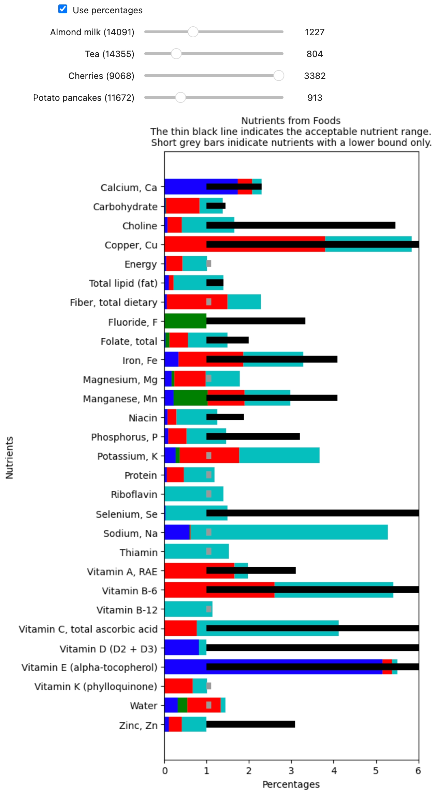

# Nutritionally Complete Foods v0.5

* [Overview](#Overview)
* [Current State of Development](#Current-State-of-Development)
* [Environment Setup](#Environment-Setup)
* [Source Data](#Source-Data)
* [The Solver](#The-Solver)
* [Example Solutions](#Example-Solutions)
* [Visualization](#Visualization)


## Overview

This program finds combination of foods that are nutritionally complete while minimizing the number of different foods and only considering foods that you might grow yourself. - If you wanted to grow a garden to completely sustain yourself, what are your options?


## Current State of Development

The solver is working and has found many solutions. Below is one example:

1. Olives, pickled, canned or bottled, green (877g) - ID #9195
2. Kiwifruit, ZESPRI SunGold, raw (1,019g) - ID #9520
3. Mushrooms, portabella, exposed to ultraviolet light, raw (303g) - ID #11998
4. Beverages, tea, black, brewed, prepared with tap water (805g) - ID #14355
5. Seaweed, Canadian Cultivated EMI-TSUNOMATA, dry (49g) - ID #31019
6. Plums, wild (Northern Plains Indians) (1,108g) - ID #35206
7. Beans, baked, canned, no salt added (956g) - ID #43449

The goal is not to find "many" solutions but all of them. Currently, every solution contains Kiwifruit and either dry or rehydrated seaweed. This leads me to suspect we're missing a lot of solutions. Plus, using a semi-brute force approach, several more solutions can be found.

Currently, this program uses an optimizing solver, which means it finds the combinations of foods that most closely meet the minimum dietary requirements. I originally chose this solver because the [Stigler Diet](https://en.wikipedia.org/wiki/Stigler_diet) problem is similar to our problem and can be solved efficiently with an optimizing solver. But, instead of trying to minimize cost, our goal is to find the fewest distinct food types. It turns out, this is a pretty fundamental difference: We don't want to find the one solution closest to the minimum requirements. We want to find all solutions.

The latest iteration of this program only gets one result back from the solver and exists as soon as a solution is found so that no time is spent optimizing. After a solution is found, we try to find solutions that don't contain that same combination of foods. Specifically, we try excluding every combination of foods in the original solution, running the solver with those foods excluded from the data set. To speed this up, this process is run across all cores and uses a PostgreSQL database to store data.

It was an idea worth trying, but there quickly become more than 10,000 combinations to try, and for sets of foods that contain no solution, the solver will run for ~3 hours before giving up. So this means the program would run for months before returning all solutions. This is only marginally better than brute force.

Back to the drawing board.


## Environment Setup

Project requirements are stored in `requirements.txt`. Setting up an environment is a little outside of the scope of this readme, but if you are unfamiliar with how to do so, I've included my preferred method in the expandable section below.

<details>
  <summary>Environment setup</summary>

```
# Your OS will need the prerequisites, and that's not particularly straightforward.
# This is what you'll need to install on Ubuntu:
sudo apt install curl git-core gcc make zlib1g-dev libbz2-dev libreadline-dev libsqlite3-dev libssl-dev liblzma-dev

# Install pyenv.
curl https://pyenv.run | bash

# Integrate into your shell. (Restart your shell after this.)
echo 'export PYENV_ROOT="$HOME/.pyenv"' >> ~/.bashrc
echo 'export PATH="$PYENV_ROOT/bin:$PATH"' >> ~/.bashrc
echo 'eval "$(pyenv init -)"' >> ~/.bashrc

# Create a virtual environment with Python 3.12.2
pyenv install 3.12
pyenv virtualenv 3.12 nutritionally-complete-foods

# Activate that virtual environment
pyenv activate nutritionally-complete-foods

# Install the requirements to that environment
pip install -r requirements.txt

# ...

# Deactivate the environment when you're done
source deactive
```

</details>


## Running The Simple Solver

After you have generated the source data file, you can run the solver to get back one solution like so:

```
python solve.py
```

This will output the first solution it finds that combine to satisfy the given dietary constrains. 

### Number of foods:

As the goal is to find the fewest number of foods required, the solver is currently hardcoded to find 7 foods. (There are no solutions with 6 foods or fewer.) The number of foods in the solution can be set with the `-n` flag:

```
python solve.py -n 9
```

### Known Solutions:

The program takes about 3hrs to run and known solutions can be found in `solve/constants.py`.


## The Combinatorial Solver

To find all solutions, first start a PostgreSQL instance with Docker and create the food database:

```
docker run -d --name food-postgres -p 5432:5432 \
    -e POSTGRES_PASSWORD=pg_password \
    -v ./pgdata:/var/lib/postgresql/data postgres:17.0

docker exec -it food-postgres psql -U postgres -c "CREATE DATABASE food;"
```

Then run the combinatorial solver:

````
python solve_all.py
````

This will spawn a process for each logical core. But, as noted above, this is still an extremely slow way to solve the problem.


## Source Data

This project uses a subset of the [USDA's SR Legacy dataset](https://fdc.nal.usda.gov/) as input. The first time the solver runs, it will prompt you to download the data file from the USDA. For our purposes, we remove all processed and non-plant-based foods, which currently leaves 1,241 foods in the list. After parsing, this results in a file called `food_data.csv` , which is one of the two input files for the solver. 

The other input file is the CSV of daily recommended values, which comes from the [USDA's Dietary Reference Intake (DRI) Calculator](https://www.nal.usda.gov/human-nutrition-and-food-safety/dri-calculator). You can either use the example file in this repo ( `data/Daily Recommended Values.csv`), or you can modify the values based on your personalized requirements. Ideally, I would like this program to directly integrate the calculation of dietary requirements, but the spreadsheet gives us a good enough initial goal.

The solver takes a couple of command-line options related to data:

* `--download`  - If the data file is missing, download the file without prompting.
* `--only-download`  - Exit after downloading the data file. (Don't solve.) This option implies --download 
* `--delete-intermediate-files` - Delete intermediate files without prompting.


## Visualization

To help me verify that the solutions were correct, I created a Jupyter notebook in the `visualize/` folder that displays a chart of the actual nutrient value vs the acceptable range. This was only used at the beginning of the project, and since then I removed several processed foods I found in the list. So, currently the example solution contains processed foods that I eventually removed from consideration (e.g. potato pancakes). Once the solver is perfected, we need to go back and create a tighter integration between the solver and the visualizer.

The notebook is run in the standard way by running `jupyter notebook`, then opening `visualize/Visualize Nutrients.ipynb` in the Jupyter web application. Even though the solutions have become a little out of date with the solver, I have included  a screenshot of the notebook below:



