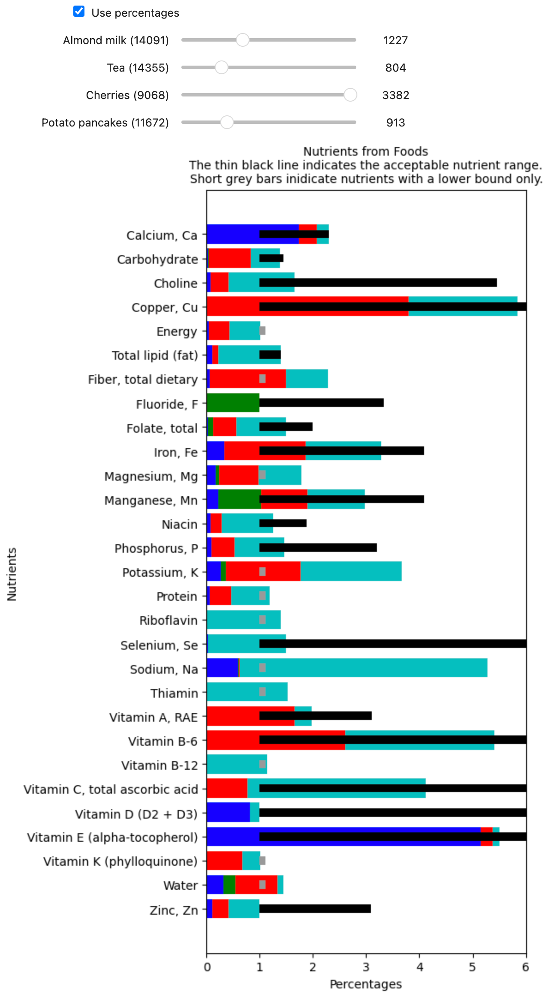

# Nutritionally Complete Foods v0.7

If you wanted to grow a garden to completely sustain yourself, what foods should you grow? This project searches for an answer to that question.

On one hand, we can choose the fewest number of distinct foods. For example, we have found that these 4 foods provide complete nutrition:


Without further ado, the main result from this project is finding the smallest set of 

* 76 g of Chili powder
* 5,653 grams of Tangerine juice (roughly 1.5 gallons)
* 202 grams of Sunflower seeds, oil roasted, without salt
* 115 grams of one type of mushroom:
  * Mushrooms, portabella, exposed to ultraviolet light, grilled
  * Mushrooms, maitake, raw
  * Mushrooms, brown, italian, or crimini, exposed to ultraviolet light, raw
  * Mushroom, white, exposed to ultraviolet light, raw

Total: 4 foods, 6,046 grams

* 301 grams of Apples, dehydrated (low moisture), sulfured, uncooked
* 85 grams of Mushrooms, shiitake, dried
* 78 grams of Onions, dehydrated flakes
* 72 grams of Oil, soybean lecithin
* 40 grams of Vital wheat gluten
* 33 grams of Mushrooms, brown, italian, or crimini, exposed to ultraviolet light, raw
* 29 grams of Seeds, sesame butter, paste
* 26 grams of Chives, freeze-dried
* 24 grams of Spices, celery seed
* 14 grams of Soybeans, mature seeds, dry roasted
* 12 grams of Papad
* 11 grams of Oil, hazelnut
* 3 grams of Mushrooms, maitake, raw
* 3 grams of Seeds, sesame flour, high-fat
* 3 grams of Tofu, dried-frozen (koyadofu)
* 2 grams of Salt, table
* 1 grams of Oil, wheat germ
* 1 grams of Prunes, dehydrated (low-moisture), uncooked
* 1 grams of Mushrooms, portabella, exposed to ultraviolet light, raw
* 1 grams of Seaweed, Canadian Cultivated EMI-TSUNOMATA, dry

Total: 20 foods, 740 grams


To be sure we have the best solution, we would ultimately like to find all combinations that are nutritionally-complete, then find the solutions that provide the best balance between fewest number of foods grown and the smallest quantity of foods required. So far, none of these goals have been completely attained. However, we have found solutions for the fewest number of foods needed, and the smallest quantity of foods required.

This project is made up of 3 parts:

* A data process that to downloads the [USDA's SR Legacy dataset](https://fdc.nal.usda.gov/), remove foods that you can’t grow yourself, and restructures the data into a format the solver can easily use.
* Several solvers that take these foods as input and finds combinations that are nutritionally complete.
* A Jupyter notebook to visualize the solutions


---
* [Overview](#Overview)
* [Current State of Development](#Current-State-of-Development)
* [Environment Setup](#Environment-Setup)
* [Source Data](#Source-Data)
* [The Solver](#The-Solver)
* [Example Solutions](#Example-Solutions)
* [Visualization](#Visualization)

---

## Solutions and Current State of Development

Without further ado, the main result from this project is finding the smallest set of 

```
Conclusion:
2009	Spices and Herbs > Spices, chili powder
9221	Fruits and Fruit Juices > Tangerine juice, raw
12038	Nut and Seed Products > Seeds, sunflower seed kernels, oil roasted, without salt
And one type of mushroom:
11939	Vegetables and Vegetable Products > Mushrooms, portabella, exposed to ultraviolet light, grilled
11993	Vegetables and Vegetable Products > Mushrooms, maitake, raw
11936	Vegetables and Vegetable Products > Mushrooms, brown, italian, or crimini, exposed to ultraviolet light, raw
11938	Vegetables and Vegetable Products > Mushroom, white, exposed to ultraviolet light, raw

# While this would theoretically work, it would unfortunately require consuming 5.7 kg of Tangerine juice each day.
qty = [
76, # '2009'
5653, #  9221
115,  # 11939
202,  # 12038
]
```

Strangely this is reminiscent of the book <u>My Father's Dragon</u> where the protagonist eats lots of tangerines.

Also,

```
('9009', 301) ['Fruits and Fruit Juices > Apples, dehydrated (low moisture), sulfured, uncooked']
('11268', 85) ['Vegetables and Vegetable Products > Mushrooms, shiitake, dried']
('11284', 78) ['Vegetables and Vegetable Products > Onions, dehydrated flakes']
('4531', 72) ['Fats and Oils > Oil, soybean lecithin']
('48052', 40) ['Cereal Grains and Pasta > Vital wheat gluten']
('11936', 33) ['Vegetables and Vegetable Products > Mushrooms, brown, italian, or crimini, exposed to ultraviolet light, raw']
('12169', 29) ['Nut and Seed Products > Seeds, sesame butter, paste']
('11615', 26) ['Vegetables and Vegetable Products > Chives, freeze-dried']
('2007', 24) ['Spices and Herbs > Spices, celery seed']
('16111', 14) ['Legumes and Legume Products > Soybeans, mature seeds, dry roasted']
('42200', 12) ['Legumes and Legume Products > Papad']
('4532', 11) ['Fats and Oils > Oil, hazelnut']
('11993', 3) ['Vegetables and Vegetable Products > Mushrooms, maitake, raw']
('12170', 3) ['Nut and Seed Products > Seeds, sesame flour, high-fat']
('16128', 3) ['Legumes and Legume Products > Tofu, dried-frozen (koyadofu)']
('2047', 2) ['Spices and Herbs > Salt, table']
('4038', 1) ['Fats and Oils > Oil, wheat germ']
('9289', 1) ['Fruits and Fruit Juices > Prunes, dehydrated (low-moisture), uncooked']
('11998', 1) ['Vegetables and Vegetable Products > Mushrooms, portabella, exposed to ultraviolet light, raw']
('31019', 1) ['Vegetables and Vegetable Products > Seaweed, Canadian Cultivated EMI-TSUNOMATA, dry']
```


In case you're wondering, I haven't gone out and planted a bunch of tangerine trees. Before a 1.0 release, I'd like to find some way to find a compromise. Large quantity of a few foods, and a small quantity of many foods.


## Current State of Development

This project is composed of 4 solvers:


The solver is working and has found many solutions. Below is one example:

1. Olives, pickled, canned or bottled, green (877g) - ID #9195
2. Kiwifruit, ZESPRI SunGold, raw (1,019g) - ID #9520
3. Mushrooms, portabella, exposed to ultraviolet light, raw (303g) - ID #11998
4. Beverages, tea, black, brewed, prepared with tap water (805g) - ID #14355
5. Seaweed, Canadian Cultivated EMI-TSUNOMATA, dry (49g) - ID #31019
6. Plums, wild (Northern Plains Indians) (1,108g) - ID #35206
7. Beans, baked, canned, no salt added (956g) - ID #43449

The goal is not to find "many" solutions but all of them. Currently, every solution contains Kiwifruit and either dry or rehydrated seaweed. This leads me to suspect we're missing a lot of solutions. Plus, using a semi-brute force approach, several more solutions can be found.

Currently, this program uses an optimizing solver, which means it finds the combinations of foods that most closely meet the minimum dietary requirements. I originally chose this solver because the [Stigler Diet](https://en.wikipedia.org/wiki/Stigler_diet) problem is similar to our problem and can be solved efficiently with an optimizing solver. But, instead of trying to minimize cost, our goal is to find the fewest distinct food types. It turns out, this is a pretty fundamental difference: We don't want to find the one solution closest to the minimum requirements. We want to find all solutions.

The latest iteration of this program only gets one result back from the solver and exists as soon as a solution is found so that no time is spent optimizing. After a solution is found, we try to find solutions that don't contain that same combination of foods. Specifically, we try excluding every combination of foods in the original solution, running the solver with those foods excluded from the data set. To speed this up, this process is run across all cores and uses a PostgreSQL database to store data.

Version 0.6 refactors the solver to add a timeout. Without a timeout, it can take a process up to 3 hours to finish. 

After running for 3 hours, there were more than 500,000 combinations to try and 56 combinations had been processed. Of these, 29 took <120 seconds, 26 took >120 seconds, and 22 timed out. Even using a 120-second timeout 500,000 combinations would take 2 years to process. It was an idea worth trying, but this method is only marginally better than brute force.

Back to the drawing board.


## Environment Setup

Project requirements are stored in `requirements.txt`. Setting up an environment is a little outside of the scope of this readme, but if you are unfamiliar with how to do so, I've included my preferred method in the expandable section below.

<details>
  <summary>Environment setup</summary>

```
# Your OS will need the prerequisites, and that's not particularly straightforward.
# This is what you'll need to install on Ubuntu:
sudo apt install curl git-core gcc make zlib1g-dev libbz2-dev libreadline-dev libsqlite3-dev libssl-dev liblzma-dev

# Install pyenv.
curl https://pyenv.run | bash

# Integrate into your shell. (Restart your shell after this.)
echo 'export PYENV_ROOT="$HOME/.pyenv"' >> ~/.bashrc
echo 'export PATH="$PYENV_ROOT/bin:$PATH"' >> ~/.bashrc
echo 'eval "$(pyenv init -)"' >> ~/.bashrc

# Create a virtual environment with Python 3.12.2
pyenv install 3.12
pyenv virtualenv 3.12 nutritionally-complete-foods

# Activate that virtual environment
pyenv activate nutritionally-complete-foods

# Install the requirements to that environment
pip install -r requirements.txt

# ...

# Deactivate the environment when you're done
source deactive
```

</details>


## Running The Simple Solver

After you have generated the source data file, you can run the solver to get back one solution like so:

```
python solve.py
```

This will output the first solution it finds that combine to satisfy the given dietary constrains. 

### Number of foods:

As the goal is to find the fewest number of foods required, the solver is currently hardcoded to find 7 foods. (There are no solutions with 6 foods or fewer.) The number of foods in the solution can be set with the `-n` flag:

```
python solve.py -n 9
```

### Known Solutions:

The program takes about 3hrs to run and known solutions can be found in `solve/constants.py`.


## The Combinatorial Solver

To find all solutions, first start a PostgreSQL instance with Docker and create the food database:

```
docker run -d --name food-postgres -p 5432:5432 \
    -e POSTGRES_PASSWORD=pg_password \
    -v "$PWD"/pgdata:/var/lib/postgresql/data postgres:17.0

docker exec -it food-postgres psql -U postgres -c "CREATE DATABASE food;"
```

Then run the combinatorial solver:

````
python solve_all.py
````

This will spawn a process for each logical core. But, as noted above, this is still an extremely slow way to solve the problem.

## The Quantity-Minimizing Solver


## Source Data

This project uses a subset of the [USDA's SR Legacy dataset](https://fdc.nal.usda.gov/) as input. The first time the solver runs, it will prompt you to download the data file from the USDA. For our purposes, we remove all processed and non-plant-based foods, which currently leaves 1,241 foods in the list. After parsing, this results in a file called `food_data.csv` , which is one of the two input files for the solver. 

The other input file is the CSV of daily recommended values, which comes from the [USDA's Dietary Reference Intake (DRI) Calculator](https://www.nal.usda.gov/human-nutrition-and-food-safety/dri-calculator). You can either use the example file in this repo ( `data/Daily Recommended Values.csv`), or you can modify the values based on your personalized requirements. Ideally, I would like this program to directly integrate the calculation of dietary requirements, but the spreadsheet gives us a good enough initial goal.

The solver takes a couple of command-line options related to data:

* `--download`  - If the data file is missing, download the file without prompting.
* `--only-download`  - Exit after downloading the data file. (Don't solve.) This option implies --download 
* `--delete-intermediate-files` - Delete intermediate files without prompting.


## Visualization

To help me verify that the solutions were correct, I created a Jupyter notebook in the `visualize/` folder that displays a chart of the actual nutrient value vs the acceptable range. This was only used at the beginning of the project, and since then I removed several processed foods I found in the list. So, currently the example solution contains processed foods that I eventually removed from consideration (e.g. potato pancakes). Once the solver is perfected, we need to go back and create a tighter integration between the solver and the visualizer.

The notebook is run in the standard way by running `jupyter notebook`, then opening `visualize/Visualize Nutrients.ipynb` in the Jupyter web application. Even though the solutions have become a little out of date with the solver, I have included  a screenshot of the notebook below:



